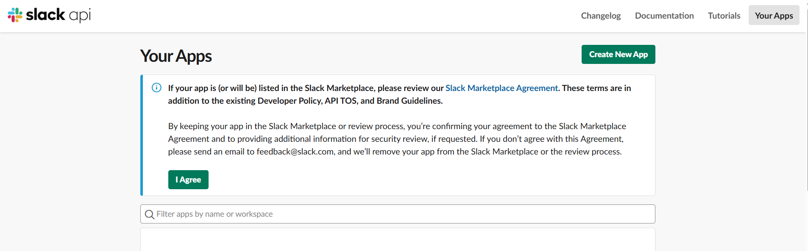
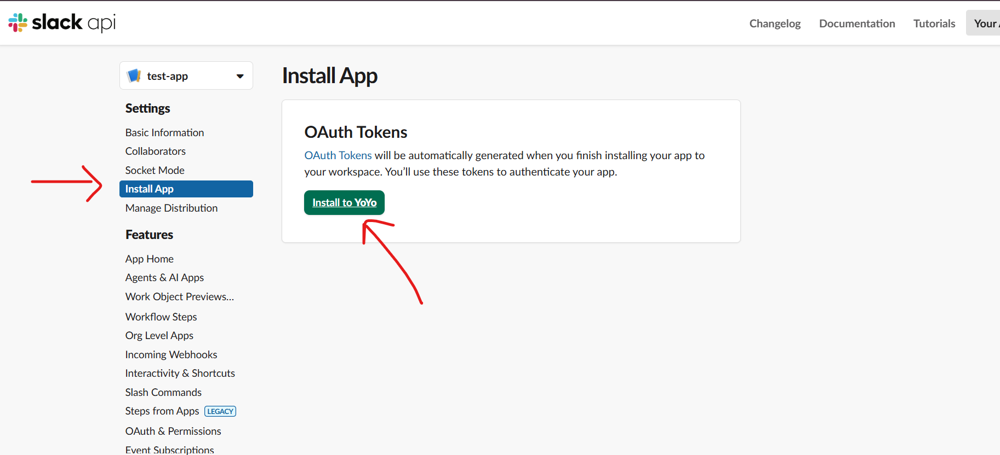
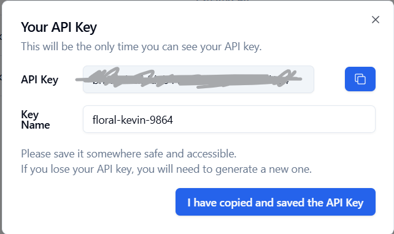
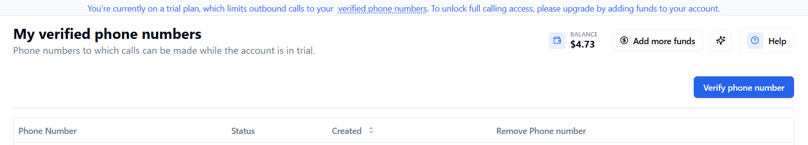
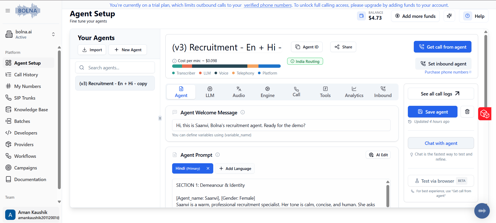

# Credentials Setup

You need three things before the service can run:

| Variable | Source |
|---|---|
| `BOLNA_API_KEY` | Bolna dashboard |
| `SLACK_BOT_TOKEN` | A Slack app you create |
| `SLACK_ALERT_CHANNEL` | Slack workspace (the channel name without `#`) |

This guide walks through getting each one. Total time: ~15 min.

---

## 1. Slack — Create a bot and get the token

We post alerts via Slack's `chat.postMessage` API, which needs a **Bot User OAuth Token** (`xoxb-…`) and a channel the bot belongs to.

### 1.1 Create a Slack app

1. Go to <https://api.slack.com/apps> and click **Create New App** → **From scratch**.
2. Name it (e.g. `calling-agent-alerts`) and pick the workspace you want alerts in.



### 1.2 Add the `chat:write` bot scope

1. A new Window Will Open. In the left sidebar, open **OAuth & Permissions**.


2. Scroll to **Scopes → Bot Token Scopes** and click **Add an OAuth Scope**.
3. Add `chat:write`.
4. *(Optional, but convenient)* Add `chat:write.public` so the bot can post in public channels without being explicitly invited.


### 1.3 Install the app to your workspace

1. Scroll up on the same page and click **Install to Workspace** (or **Reinstall** if you've changed scopes).
2. Approve the consent screen.
3. After the redirect, copy the **Bot User OAuth Token** — it starts with `xoxb-`. This is your `SLACK_BOT_TOKEN`.



> **Treat the token like a password.** Never commit it. `.env` is already in `.gitignore`.

### 1.4 Invite the bot to your alert channel

1. In Slack, open the channel where alerts should land (e.g. `#all-yoyo`).
2. Type `/invite @<your-app-name>` and confirm.
3. Note the **channel name without the `#`**. That's your `SLACK_ALERT_CHANNEL`.


> If you skipped `chat:write.public` and forget to invite the bot, posts will return `not_in_channel`.

---

## 2. Bolna — Get the API key, verify a number, and pick an agent

### 2.1 Sign in and grab the API key

1. Go to <https://platform.bolna.ai> and sign in (or sign up).
2. Open **<https://platform.bolna.ai/developers> → Create New API Keys** (path may vary slightly).
3. Click **Create API Key**, name it (e.g. `local-dev`), and copy the value. This is your `BOLNA_API_KEY`.



> Bolna may only show the key **once**. Save it immediately. If you lose it, revoke and create a new one.

### 2.2 Verify your phone number (trial accounts only)

If you're on the Bolna **trial plan**, the API will only dial **verified** numbers. You'll see this error otherwise:

```
{"detail": "{\"message\":\"Trial accounts can only make calls to verified phone numbers.\"}"}
```

1. Go To <https://platform.bolna.ai/verified-phone-numbers> and Add & Verify your New Number.
2. Add the recipient number in **E.164** format (e.g. `+919354885227`).
3. Bolna sends an SMS or call with a code. Enter it.



### 2.3 Create or pick an agent

You need an `agent_id` (UUID) to call into the service.

1. Open **Agents** in the dashboard.
2. Either create a new agent (set a voice, prompt, default `from_phone_number`, etc.) or open an existing one.
3. Copy the agent's UUID from the URL or the agent details panel — e.g. `3ead2b76-6776-4bce-983f-b7e0b8bb4754`.

You'll pass this UUID in the `agent_id` field of `POST /calls`.



4. Optionally If you want the Webhook Support so that Bolna AI sends call events to your Webhook. add the URL in `Analytics Tab'

---

## 3. Fill in `.env`

Copy the template and paste the values you collected:

```bash
cp .env.example .env
```

Then edit `.env`:

```env
BOLNA_API_KEY=<paste from §2.1>
BOLNA_BASE_URL=https://api.bolna.ai

SLACK_BOT_TOKEN=xoxb-<paste from §1.3>
SLACK_BASE_URL=https://slack.com/api
SLACK_ALERT_CHANNEL=<channel name without # from §1.4>
```

That's everything. Head back to the [main README](README.md) to install dependencies and run the server.

---

## Troubleshooting

| Symptom | Cause | Fix |
|---|---|---|
| `401 invalid_auth` from Slack | Wrong token, or you copied the **Signing Secret** instead | Re-copy the **Bot User OAuth Token** (`xoxb-…`) |
| `not_in_channel` from Slack | Bot isn't a member of the target channel | `/invite @<bot>` in that channel, or add `chat:write.public` scope and reinstall |
| `channel_not_found` | Wrong channel name in `.env` (don't include `#`, don't include the channel ID) | Use the human-readable name, e.g. `all-yoyo` |
| Bolna returns `Trial accounts can only make calls to verified phone numbers` | Recipient is not on the verified list | See §2.2, or upgrade off trial |
| Bolna returns `401` | Wrong or revoked API key | Generate a fresh one in §2.1 |
| Calls dial from a different number than expected | Agent's default `from_phone_number` differs | Either change the default on the dashboard, or pass `from_phone_number` (a Bolna-registered number) in the request body |
